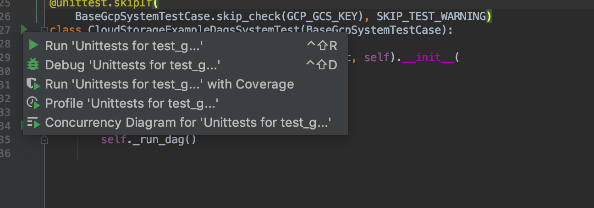
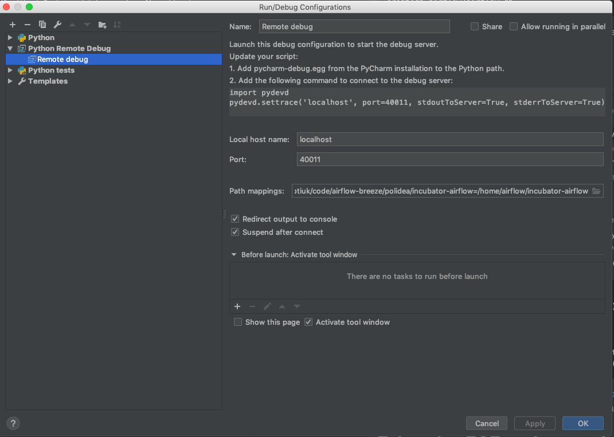
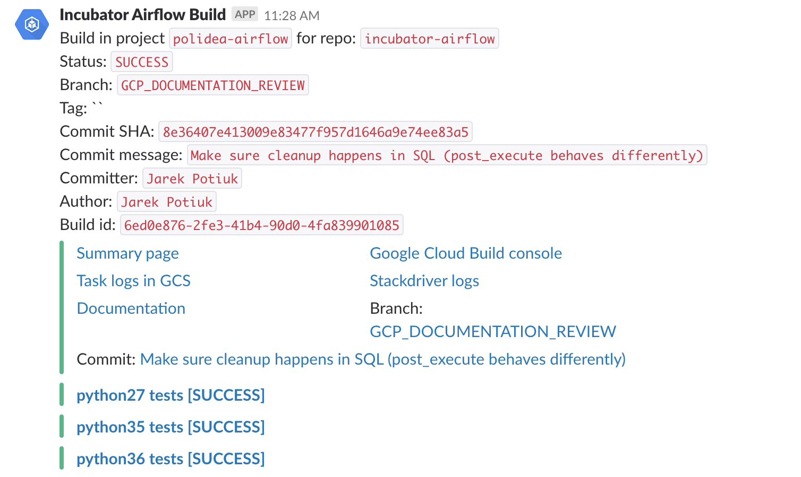

# System Tests

System tests are used to tests Airflow operators with an existing Google Cloud Platform
services. Those are e-2-e tests of the operators.

# Example DAG

The operators you develop should have example DAGs defined that describe the usage
of the operators, and are used to provide snippets of code for the 
[Documentation of Airflow](https://airflow.readthedocs.io/en/latest/howto/operator.html)

Those example DAGs are also runnable - they are used to system-test the operators 
with real Google Cloud Platform.

After you enter the environment, the interesting example dags are automatically 
symbolically linked to /airflow/dags so that you can start them immediately. 
Those DAGs are immediately available for `airflow` commands - for example 
`airflow list_dags` or `airflow list_tasks <dag_id>`. 

Using symbolic links is for convenience - since those
are symbolic links and the linked DAGS are in your sources which are mounted from
the local host environment - this way you can modify the DAGs locally and they will be
immediately available to run. You can choose which dags you want to link symbolically 
via `AIRFLOW_BREEZE_DAGS_TO_TEST` environment variable in the `variables.env` in 
`config` folder in your workspace.

Most of the DAGs you work on are in `/workspace/airflow/example_dags` or
`/workspace/airflow/contrib/example_dags/` folder.

# System test classes

It is easiest to run the System Tests from your IDE via specially defined System Test
classes (inheriting from `DagGcpSystemTestCase` class) using the standard python 
Unit Tests framework. By convention they are placed in 
the `*_system.py` modules of corresponding tests files (in `test/contrib/` directory).
Example of such test is `GcpComputeExampleDagsSystemTest`
in `test/contrib/test_gcp_compute_operator_system.py`.

If you want to use simply GCP authentication support for System Tests without
actually running an example DAG, you can also inherit from 
`BaseGcpSystemTestCase` - this way you can run any tests that communicate with GCP.

Such tests in some cases can have custom setUp/tearDown routines to set-up the Google
Cloud Platform environment - to setup resources that would be costly to keep running
all the time.

When you run such System Test, the setUp will set everything up - including
authentication using specified service account and resetting the database. 
In case of custom setUp, it might also create necessary resources in Google Cloud 
Platform. For example in case of the `GcpComputeExampleDagsSystemTest` 
the custom setUp creates instances in GCE to perform start/stop operations. 
After the setup is complete, the tests run selected example DAG.

The DAG id to run is specified as parameter the constructor of the test - by convention
name of the file has to be the same as dag_id. For example in case
of `GcpComputeExampleDagsSystemTest` the test runs `example_gcp_compute.py` example DAG
with `example_gcp_compute` dag id. 
After the test is done, the tearDown deletes the resources.

The System Tests have per-project configuration (environment variables)
Configuration for the tests is stored in  `config` directory 
in `variables.env`.

The System Tests are skipped by default outside of the container environment when
standard unit tests are run (for example they are skipped in Travis CI). 
This is controlled by presence of service account keys that are used to 
authenticate with Google Cloud Platform. Each test service has its own, dedicated
service account key. Available service account key names can be configured in 
`test_gcp_base_system_test.py`. You can add new service account via bootstrapping as
described in [README.md](README.md#Adding-new-service-accounts)

# Running the System Tests

## Running System Tests via IDE (IntelliJ)

You run the system tests via IDE in the same way as in case of the 
[Unit tests](README.unittests.md) - you need to configure virtual environments
in the same way as described there.

You need to enter the container environment at least once before
you start running the system tests via IDE. This is because the environment 
variables from last used workspace will be automatically
sourced and used by the System Tests from the IDE. This is done using
[Get system environment variables script](get_system_test_environment_variables.py)

Running system tests from the IDE looks exactly the same as running unit tests:



If you have no `AIRFLOW_HOME` variable set the logs, airflow sqlite databases
and other artifacts are created in your ${HOME}/airflow/ directory. Otherwise
they are stored in `AIRFLOW_HOME` directory. 

There are some tests that might require long time setup of costly resources
and they might need additional setup as described in 
[System test cases with costly setup phase](#System-test-cases-with-costly-setup-phase).
Those tests will warn you if the setup is not done before they are run.

## Running System Tests within the container environment

You can run the System Tests via standard `nosetests` command. 
```
nosetests tests.contrib.operators.test_gcs_acl_operator_system 
```

There are few flags that might be useful for debugging:

```
nosetests tests.contrib.operators.test_gcs_acl_operator_system -v --logging-level=DEBUG --debug=tests
```

Where:
  * -v - enables verbose logging of nose actions
  * --logging-level=DEBUG - enables debug logs for test methods
  * --debug=tests - enables debug logging for setUp/tearDown phase of tests in tests.* packages

Unlike unit tests - the system tests should not be run 
using `./run_unit_test.bash`, because they cannot have `AIRFLOW__CORE__UNIT_TEST_MODE` 
variable set to True and `./run_unit_test.bash` sets the variable.

The logs, airflow sqlite databases and other artifacts are created in /airflow/ directory.

Again - there are some tests that might require long time setup of costly resources
and they might need additional setup as described in 
[System test cases with costly setup phase](#System-test-cases-with-costly-setup-phase)
Those tests will warn you if the setup is not done before they are run.

## Testing single tasks of DAGs in container environment

This is the fastest and most developer-friendly way of iterating on your operator
while you are developing it. 
Some of the system tests require special setUp - you can run the 
setUp manually using helpers as described in the following chapter.

After the setup is done, you can run separate tasks for each dag via:

```
airflow test <DAG_ID> <TASK_ID> <DATE>
```

The date has to be in the past and in YYYY-MM-DD form. For example:

```
airflow test example_gcp_sql_query example_gcp_sql_task_postgres_tcp_id 2018-10-24
```

This runs the test without using/storing anything in the database of airflow and it
produces output in the console rather than in the log files. You can see list of DAGs and
tasks via `airflow list_dags` and `airflow list_tasks <DAG_ID>`.

## Executing custom setUp/tearDown manually

In order to run the individual tasks in container environment, custom setUp / tearDown 
might need to be run before tests. For example you must create GCP resources necessary 
to run the instance tests. There is a way to run such setUp/tearDown manually via 
helper scripts. Typically such  helper script is named the same as the system test 
module with  `_helper` added. 
For example `test_gcp_compute_operator_system_helper.py` for tests in 
`test_gcp_compute_operator_system.py`.

You should run such helper with appropriate action. For example:

```
./tests/contrib/operators/test_gcp_compute_operator_system_helper.py  --action=create-instance
```

You can run each helper with `--help` to see all actions available.

Do not forget to delete such resources with appropriate action when you are done testing.
Each helper has appropriate actions to delete those resources.

## Run whole example DAGs using full airflow in container

Using Airflow Breeze you can also run full Airflow including wbserver and scheduler.

-   Use `run_environment.sh --forward-port <PORT>` to run a container with the port 
    forwarded to 8080 (where webserver listens for connections).
-   It is easiest run tmux session so that you can have multiple terminals
    within your container. Open multiple tmux terminals.
-   Start the webserver in one of the tmux terminals: `airflow webserver`
-   View the Airflow webapp at `http://localhost:<PORT>/`
-   Start the scheduler in a separate tmux terminal: `airflow scheduler`
-   It may take up to 5 minutes for the scheduler to notice the new DAG. Restart
    the scheduler manually to speed this up.


## Debugging System Tests using remote Debugger

When you run example DAGs - even if you run them using UnitTests from within IDE, they 
are run in a separate process / python interpreter - using `airflow` command. This makes
it a little harder to use with IDE built-in debuggers. Similarly if you run your tests 
in container environment the process is run in the container, sources are located in 
`/home/airflow/` directory and it's not obvious how to debug it easily with debugger.
 
Fortunately for IntelliJ/PyCharm it is fairly easy using remote debugging feature (note 
that remote debugging is only available in paid versions of IntelliJ/PyCharm).

You can read [general description about remote debugging](https://www.jetbrains.com/help/pycharm/remote-debugging-with-product.html)

You can setup your remote debug session as follows:



## Debugging System test in container environment

If you run your process within container environment you use the same remote debugging
but you also have to remember about configuring source code mapping
in remote debugging configuration:


The mapping should map local path of your project in Host with 
`/home/airflow/airflow` directory in remote docker environment. Then 
Run `Debug` command of the remote debugger and see that it prints the exact 
import and settrace lines of code that you need to copy&paste in your code where you
want to start debugging.

Also in case of running in container make sure to use IP address of your host
machine rather than `localhost`. On Mac OS docker is run in a 
separate virtual machine therefore you need to specify the host IP address to connect to:


This way you can debug code run via `airflow test`

# Additional System test topics

## Running System Tests via Google Cloud Build (Continuous Integration)

You can setup Google Cloud Build in the way that all relevant unit and system tests are
run automatically when you push the code to your GitHub repository. This is described
in [README.setup.md](README.setup.md). 

If you setup your GitHub project with master branch is protected checks enabled
this is an easy way to make sure that you have not broken the existing operators. 
Simply let Cloud Build run all the relevant Unit and System Tests. 
The tests are run in parallel in all configured python
environments - 2.7, 3.5 and 3.6 currently.

When you also setup slack notification, you will get notified about build status
including some useful links such as Documentation, status of tests in each build as
well as link the log files (in Stackdriver for test logs and in Google Cloud Storage
for particular task logs).

These are example Slack notifications that inform you about build status:



You can follow the links and you have the Summary Page which is publicly available and
you can share it with others.


## System test cases with costly setup phase

There are some tests that have very long setup phase. Those
tests are skipped by default within container environment. 
You can run such tests automatically by setting appropriate environment variables. 
For example `CloudSqlQueryExampleDagsSystemTest` test requires to setup 
several cloud SQL databases and it can take up to 10-15 minutes to complete sometimes. 
In order to run such tests manually you need to:

* Run appropriate helper's action to create resources (`before-tests`). For 
example:

```
./tests/contrib/operators/test_gcp_sql_operator_helper.py --action=before-tests`.
```
* set environment variable that enables the test. For example in case of
`CloudSqlQueryExampleDagsSystemTest` you should set `GCP_ENABLE_CLOUDSQL_QUERY_TEST`
to `True`.
* Run the System Test (can be repeated).
* Do not forget to remove the resources after you finished testing. For example:

```
./tests/contrib/operators/test_gcp_sql_operator_helper.py --action=after-tests`.
```

## Naming the resources

You have to name your resources appropriately when you create example dags and 
update `variables.env`. Your resources (instance names, clusters etd.) should contain
`AIRFLOW_BREEZE_UNIQUE_SUFFIX` variable in order to maintain isolation between
parallel runs of the System Tests. The `AIRFLOW_BREEZE_UNIQUE_SUFFIX` variable is
build from two variables `AIRFLOW_BREEZE_TEST_SUITE` and `AIRFLOW_BREEZE_SHORT_SHA`
separated with `-`. 

Note that even single build in Cloud Build consists of parallel runs of test suites
- one for each python version supported, so if you fail isolating those, the 
parallel runs will interfere with each other. You can see examples of 
how the resources shoudl be named see examples in 
 [TEMPLATE-variables.env](bootstrap/config/TEMPLATE-variables.env).
 
Note that in some cases names cannot contain `-` character - in this case you can
replace the `-` in generated names with another character. You can see how it is done
in the Google Cloud Functions example DAG:

```python
import os
GCF_SHORT_FUNCTION_NAME = os.environ.get('GCF_SHORT_FUNCTION_NAME', 'hello').\
    replace("-", "_")  # make sure there are no dashes in function name (!)
```

### Unique Suffix in Cloud Build environment

When the System Tests are run in Cloud Build environment, the
`AIRFLOW_BREEZE_TEST_SUITE` is set to `python<PYTHON_VERSION>` and 
the `AIRFLOW_BREEZE_SHORT_SHA` is set to first 7 digits of commit SHA. This 
is very useful to isolate parallel tests run for all python versions and to isolate
several parallel builds from different branches.

Example `AIRFLOW_BREEZE_UNIQUE_SUFFIX` in Cloud Build  : `python36-d3sedw3`

### Unique Suffix in local docker environment or when using IDE

When you enter your lockla docker environment, you automatically get 
`AIRFLOW_BREEZE_TEST_SUITE` and `AIRFLOW_BREEZE_SHORT_SHA` generated for you.

The `AIRFLOW_BREEZE_TEST_SUITE` is built from first 6 ascii characters of user name
and python version with stripped '.'.

The `AIRFLOW_BREEZE_SHORT_SHA` is generated randomly 7 alphanum lowercase characters,
mimicking first 7 digits of commit SHA.

Example `AIRFLOW_BREEZE_UNIQUE_SUFFIX` in local environment  : `potiuk36-7sdefra`

This is pretty useful in order to make sure that your instance is exclusively used 
by you. It also helps with mitigating the problem that some names cannot be 
reused for some time once deleted. This is the case for Cloud SQL instances for
example. The random number is generated and stored in your `airflow-breeze` main folder
in `.random` file (which is ignored by git). If you want to regenerate the random
number - simply delete the file and enter the environment.

## Using LocalExecutor for parallel runs

Usually when you run the System Tests via IDE - they are executed using local 
sqlite database and SequentialExecutor. This does not require any setup 
for the database - the sqlite database will be created if needed and reset before each 
test (setUp takes care about it). That's why you can run the tests without any 
special setup.

However some SystemTests require parallelism which is not available with sqlite and
SequentialExecutor. Those tests have `require_local_executor` constructor parameter
set to True and they will fail without Postgres database and configuration to use
Local Executor.

One such example is `BigTableExampleDagsSystemTest`. 

In order to run those tests you need to have `AIRFLOW_CONFIG` variable set to 
`tests/contrib/operators/postgres_local_executor.cfg` and you need to have
a local Postgres server running with airflow database created. 

The Postgres airflow database can be created using those commands:

  ```
  createuser root
  createdb airflow/airflow.db
  ```

When using container environment, by default all tests are run using LocalExecutor and 
Postrgres database is used as metadata database.

## Writing your own System tests

There are a few important things to remember when writing your system tests/example 
DAGs:

* Use environment variables defined in `variables.env` and follow naming conventions that 
  are used for other operators (including service prefix). Make sure when you add new
  variables, you also add them in 
  [Template for variables.env](bootstrap/config/TEMPLATE-variables.env).
* Make sure to use `AIRFLOW_BREEZE_UNIQUE_SUFFIX` in your resource name (usually instance)
  this will make sure your parallel tests can run in isolation. Read more about it at 
  [Naming the resources](#Naming-the-resources) chapter.
* In case you need to run several tasks of your DAG in parallel, add 
  `require_local_executor` set to `True` in super constructor.
* make sure you delete the instances in tearDown() methods using gcloud commands. This
  is a preventive action in case your tests fail - this will make sure that after the 
  test is run you always delete costly GCP resources. You can see an example of that
  in `GcpComputeIgmExampleDagsSystemTest`. Usually you should have a helper that 
  implements appropriate actions. Make sure you surround your code with GCP 
  authentication code:
```
  def tearDown(self):
        self.gcp_authenticator.gcp_authenticate()
        try:
            ... PERFORM YOUR TEARDOWN HERE ....
        finally:
            self.gcp_authenticator.gcp_revoke_authentication()
         super(<YOUR_TEST_CLASS>, self).tearDown()
```
* When you implement helper classes - following
  [Custom setUp/tearDown](#Executing-custom-setUp/tearDown-manually) 
  please implement `before-tests` and `after-tests` actions (even if they do nothing).
  These two actions are run by Cloud Build tests before the tests. 
